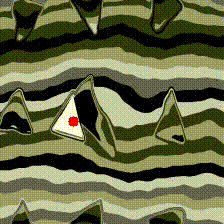
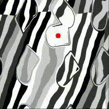
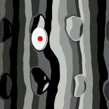
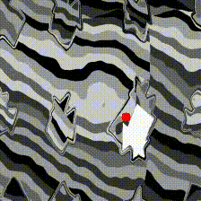

# 🎯 LackTracker: Deep Learning-based Object Tracking Framework

A high-performance **domain-specific object tracking system** optimized for **speed and accuracy** rather than generalization.

---

## 🚀 Key Features

- ✅ **Domain-optimized**: Reduced generality = faster and more accurate tracking
- 🔍 **Multi-scale feature extraction** with MobileNetV3 backbone
- 🧠 **Cross-scale attention fusion** for combining features
- 🔄 **Temporal ConvLSTM** to handle object tracking over time
- 📍 **Heatmap-based regression** for precise object coordinates
- ⚙️ **ONNX optimization** for deployment
- ⚡ **Ultra-fast inference**: ~0.2s for 132 frames on **CPU**

---

## 📷 Demo Results

**Model In Action:**

    

  


---

## 🛠️ Installation

```bash
# Clone the repository
git clone https://github.com/sexy-yume/LackTracker.git
cd LackTracker

# Create and activate a virtual environment
python -m venv venv
source venv/bin/activate  # On Windows: venv\Scripts\activate

# Install the required packages
pip install torch torchvision tqdm sklearn numpy opencv-python wandb optuna onnx onnxruntime onnxoptimizer
```

---

## 🧪 Usage

### 📚 Prepare Your Data
```
data/
  video1/
    frames/
      1.png
      2.png
      ...
    annotations.txt  # format: frame_idx x y width height
  video2/
    ...
```

### 🏋️ Training with Hyperparameter Optimization
```bash
python LackModel.py
```

### 🔄 Convert to ONNX
```bash
python lackmodelonnx.py
```

### 🔎 Run Inference
```bash
python lackonnxinfer.py
# Enter your PNG folder path when prompted
```

---

## 🧱 Model Architecture

```
Input Video Frames
        ↓
 MobileNetV3 Backbone
        ↓
Cross-Scale Attention Fusion
        ↓
  Temporal ConvLSTM
        ↓
   Regression Head
        ↓
Predicted Coordinates
```

---

## 🔬 Technical Details

- **Loss**: Smooth L1 Loss  
- **Optimizer**: AdamW  
- **Learning Rate**: Warmup for 5 epochs  
- **Gradient Clipping**: Max norm 1.0  
- **Early Stopping**: Patience = 10 epochs  
- **Hyperparameter Tuning** via Optuna:
  - Learning Rate: 1e-5 to 1e-3
  - Hidden Dimension: 192–384
  - ConvLSTM Layers: 2–3

---

## 🧠 ONNX Optimization Passes

- eliminate_deadend  
- eliminate_nop_dropout  
- fuse_consecutive_transposes  
- fuse_matmul_add_bias_into_gemm  
- eliminate_nop_transpose  

---

## 📊 Performance Metrics

- 🎯 **MSE** for coordinate accuracy  
- 📏 **Distance Accuracy** within threshold  
- ⚡ **Inference Speed**: ~0.2s / 132 frames on CPU  

---

## 🌟 Highlights

- ✅ **Optimized for real-world domains**
- ⚡ **Blazing speed on CPU**
- 🎯 **High accuracy**
- 💻 **Efficient deployment** without GPU

---

## 🤝 Contributing

Your feedback, issues, and PRs are welcome! See [issues page](https://github.com/sexy-yume/LackTracker/issues).

---

## 📄 License

MIT License

---

## 📬 Contact

- **Author**: sexy-yume  
- 📧 Email: [amwl1234@gmail.com](mailto:amwl1234@gmail.com)  
- 🔗 [GitHub Project](https://github.com/sexy-yume/LackTracker)

> ⭐ _If you find this project useful, please give it a star on GitHub!_
